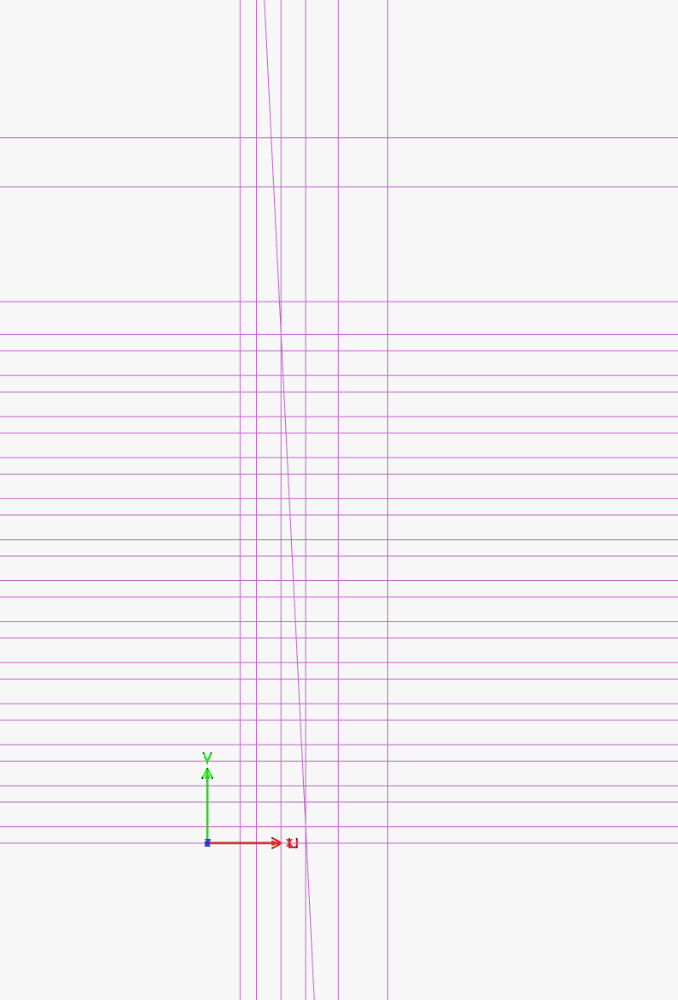
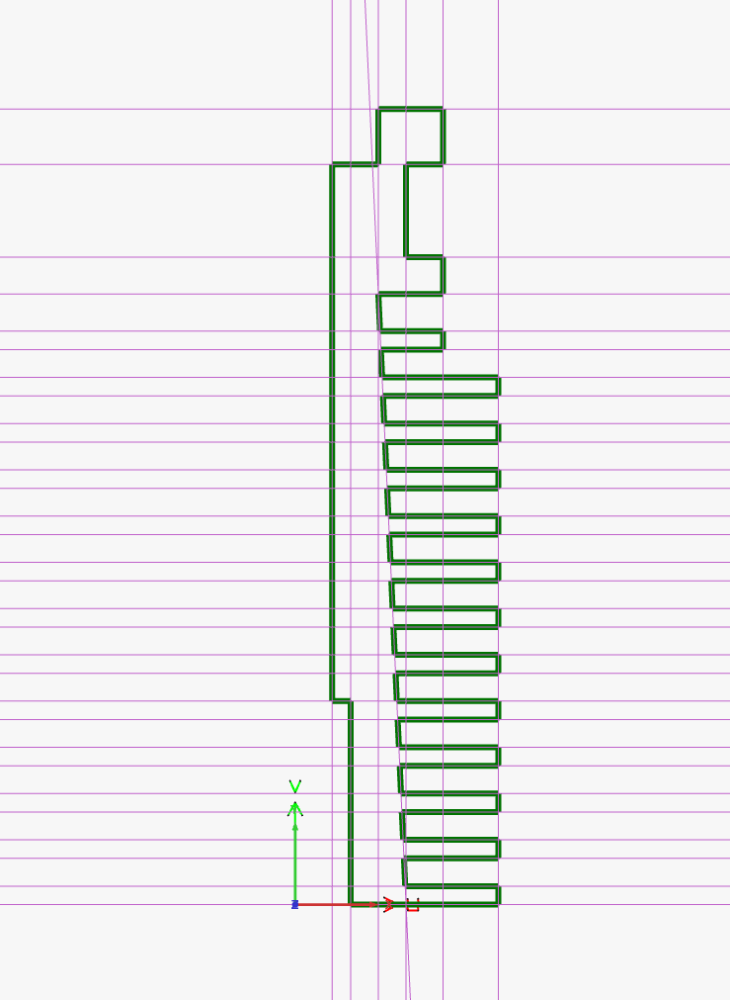
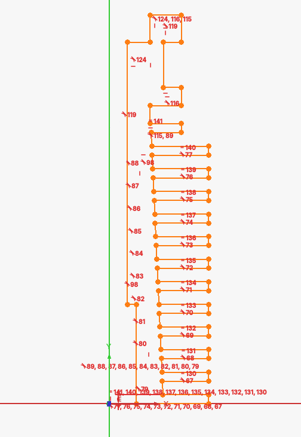
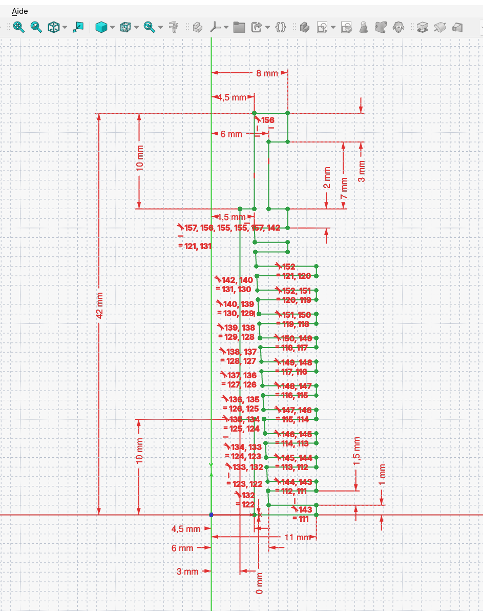
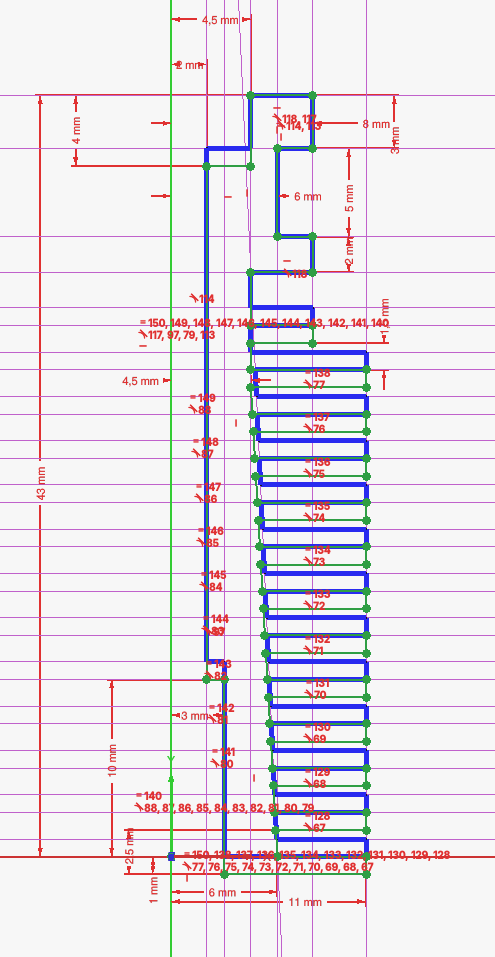
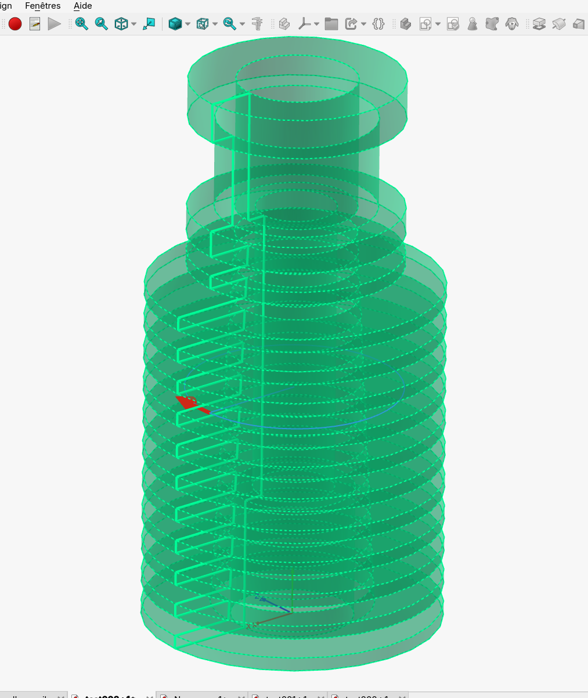
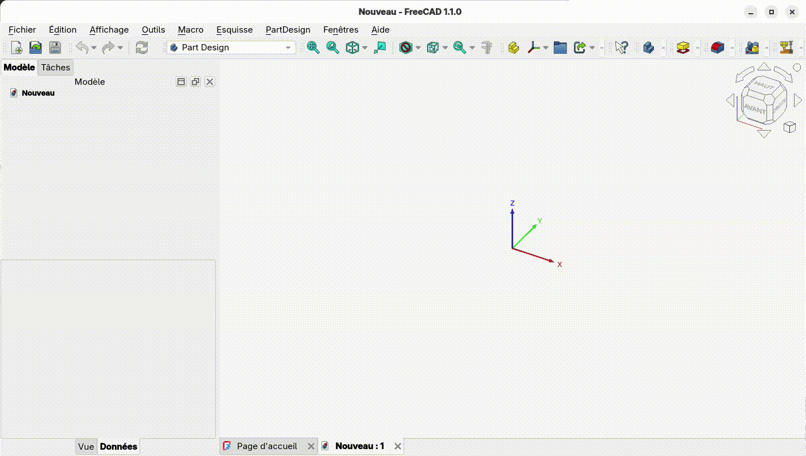

# euSKlidWB

**euSKlid** is a FreeCAD Workbench dedicated to planar geometric construction,

inspired by classical geometry (ruler & compass), with a clear workflow:

> **Construction → Contour → Export**

The name "euSKlid" is meant to remind that the author didn't actually create anything; he's
just an old-timer, one of those who knew CAD software in the 90s, and who then saw parametric design as a distant prospect.

He drew heavily on his nostalgic memories of a time (that those under... and all that...) when 3D modeling was practiced
by draftsmen (yeah, mechanical pencil, tracing paper, ruler, compass...). And yes, those old-timers
had a topological and descriptive approach to representation, and it was very
instinctive. So basically, here's the thing: parametric sketchers are great, but if they can be aided by instinct, that's even better.

And for the author (that old fart who writes stuff no one will ever read), the very best was represented by the sketcher from one of the giants of modeling at the time, which "mysteriously" disappeared when its (French) publisher was acquired by its direct (French) competitor in 1999... hence the name.

And incidentally, regarding the author, this is his first experience with "vibe coding," because you shouldn't expect a draftsman who becomes an IT manager to know how to code a FreeCAD plugin.

Joking aside... Two sketchers in a design software is one sketcher too many. To imagine replacing FreeCAD's parametric sketcher would be:
- A blatant lack of respect for its creators
- A challenge to the philosophy of FreeCAD

Therefore, this project doesn't belong as an alternative; it simply aims to say, "Hey, this kind of tool has its place in a design process," and to try to convince some users. Perhaps I'm hoping that one day, in the menu of the
real FreeCAD sketcher, I'll find a submenu leading to a kind of topology assistant that would provide this kind of design assistance ;)

And I'd like to take this opportunity to point out that, as a friend told me, the FreeCAD team has
clearly stated its position regarding "AI generated" contributions:

https://blog.freecad.org/2026/03/16/rules-regarding-ai-generated-patches/

I agree with this position, and I should add that during this experience, even though I'm not a developer, I had
to force myself to delve into this code, because I had to repeatedly tell the agent how to factor, organize, and
architect everything. If I find things that make me cringe, I don't dare imagine what someone competent might find there.

...So as far as I'm concerned, it stops at the Proof of Concept...

---

## ✨ Non-Objective

Replace FreeCAD's Sketcher:
- Which is parametric
- Which has an excellent constraint analyzer
- Which does its job very, very well
- Whose code is under control
- Which is supported by a team

---

## ✨ Objective

Show that descriptive/topological design can offer an alternative or rapid, targeted, and visual assistance
to direct parametric design, specifically for:

- building clean geometries *very* quickly
- defining precise contours
- pre-determining constraints usable in modeling

---

## 🧠 Philosophy

- ✔ Explicit geometry
- ✔ Constant visual feedback
- ✔ No hidden magic
- ✔ Linear and readable workflow

---

## 🚀 Features

### 🔹 Construction
- Lines:
  - 2 anchors:
    - Free points
    - Notable points (advanced snapping)
  - Parallels (//U, //V, //Ref):
    - Lists of values
    - Repeat patterns (repeat 13 (0,1) origin 0 step 2.5)
    - Composition of patterns and lists (rep 13 (0,1) org 0 stp 2.5, r 4 (1,5,6) o 40 s 10, 65, 75, 87)
  - Series and grids
- Circles:
  - Center / radius
  - Various tangents
  - 3 points
- Advanced snapping calculated on the fly for all anchors:
  - Points
  - Centers
  - Intersections
  - Tangents
- Dynamic preview of candidate result options

---

### 🔹 Outline (Path)
- Guided entity selection
- Controlled closing
- Real-time visualization

---

### 🔹 Export
- Export to Sketcher FreeCAD
- Manage multiple contours
- Search for constraints to export

---

## ⚙️ Configuration

### UI
- Colors, transparency, and thickness of different construction types
- Colors, transparency, and size of different "Points"

### Work
- Construction
- Contour
- Highlight

### Feeling
- Snap threshold (pixels)
- Autogrid
- Console messages / Help

---

## 📦 Installation

Everything is located in: ~/.local/share/FreeCAD/v{x-y}/Mod/euSKlidWB.
And no, sorry, I don't know about Windows, but it should be in the documentation.

---

## 📦 Pictures ...

- Constructions

- Path

- Raw export, quite overconstrained

- Constrains correcte in FreeCAD's Sketcher

- Constrains modified in FreeCAD's Sketcher

- Rev solid from the path

- Fonctionnal flyby

